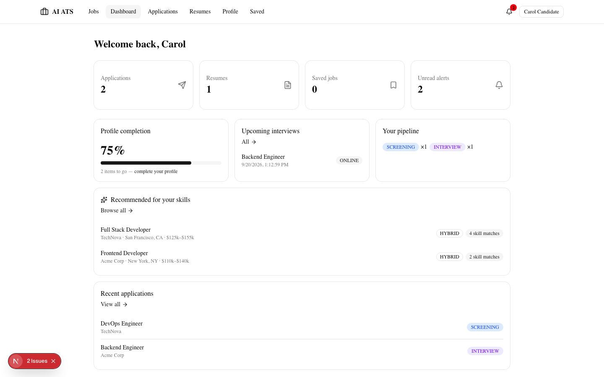
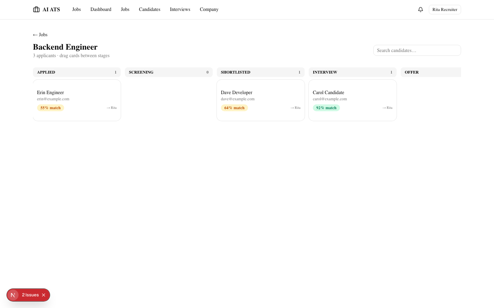
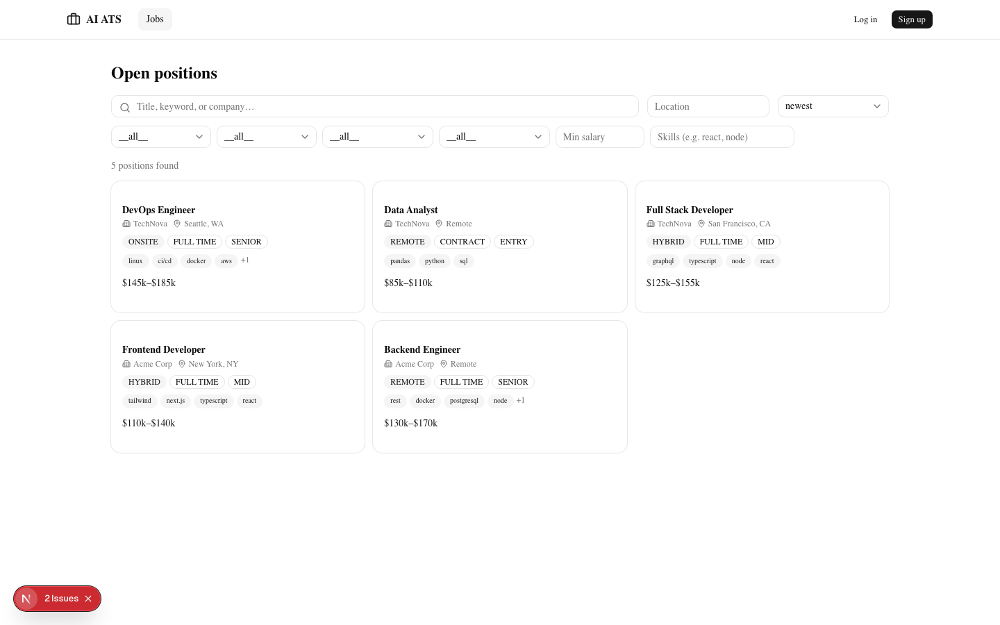
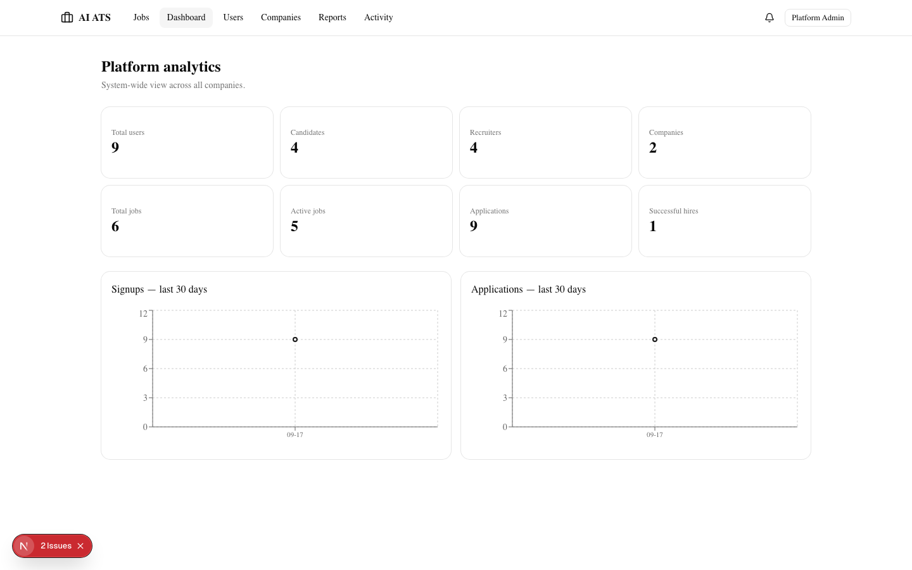
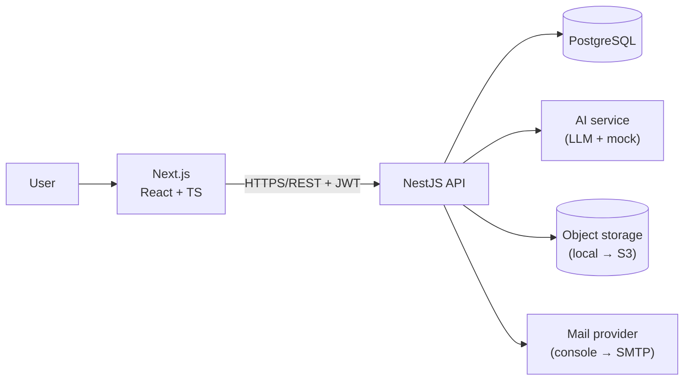

# AI ATS — AI-Powered Applicant Tracking System


A production-style, multi-tenant SaaS ATS. Companies post jobs, candidates
apply with AI-parsed resumes, recruiters run a kanban pipeline with AI match
scoring, hiring managers review assigned candidates, and admins moderate the
platform — with notifications, transactional email, audit logging, and a full
test + CI setup.

## Features

- **4 roles + RBAC** — candidate, recruiter, hiring manager, admin (company
  admin is tenant-scoped, superadmin platform-wide; HMs see only assigned jobs)
- **Job posting & lifecycle** — DRAFT → PUBLISHED ⇄ PAUSED → CLOSED, deadlines,
  required vs preferred skills, salary validation
- **Server-side job search** — keyword (pg_trgm GIN), location, skills,
  level, salary overlap, type, mode, date posted — paginated, never filtered in JS
- **Kanban pipeline** — HTML5 drag-and-drop, append-only status history
  with reasons, candidate withdrawal rules
- **Resume management** — PDF/DOCX upload (validated, 5MB, sanitized names),
  AI parsing into a normalized profile
- **AI features** — resume parsing, skill extraction, match scoring, candidate
  summaries, interview questions (editable + persisted), JD analysis — all
  labeled *AI-generated estimate*, all behind a service layer with a
  deterministic mock fallback
- **Interviews** — ONLINE/PHONE/ONSITE scheduling, distinct interviewer,
  reminders via hourly cron
- **Notifications + email** — 9 notification types, unread count, mark read/all,
  templated emails behind a swappable `MailProvider`
- **Dashboards** — candidate (completion %, skill-based recommendations),
  recruiter (funnel + 30-day trend), admin (platform analytics)
- **Security** — argon2id, rotating refresh tokens, rate limiting, helmet,
  tenant+row scoping, uniform error envelope, audit log
- **Testing & CI** — 25 unit tests, 18-check e2e workflow, Vitest, GitHub Actions

## Screenshots

| Candidate dashboard | Recruiter kanban |
|---|---|
|  |  |

| Job search | Admin analytics |
|---|---|
|  |  |

All 22 screens in [`docs/screenshots/`](docs/screenshots/) — captured live
with `frontend/screenshots.mjs` (Playwright).

## Architecture



Guards run globally in order: **Throttler → JWT → Roles**, then controllers
apply tenant + row scoping. Every error exits as
`{success:false, error:{code,message}}`. Full detail:
[ARCHITECTURE.md](docs/ARCHITECTURE.md) ·
[DIAGRAMS.md](docs/DIAGRAMS.md) (10 Mermaid diagrams) ·
[API.md](docs/API.md) (all 64 endpoints) ·
[DATABASE.md](docs/DATABASE.md) (ERD + constraints) ·
[SECURITY.md](docs/SECURITY.md) · [DEPLOYMENT.md](docs/DEPLOYMENT.md) ·
[DOCKER.md](docs/DOCKER.md) · [STRUCTURE.md](docs/STRUCTURE.md) ·
[INDEXES.md](docs/INDEXES.md) · [PHASES.md](docs/PHASES.md) ·
**[LEARNING.md](docs/LEARNING.md)** (module-by-module interview prep)

## Tech stack

| Layer | Technology | Why |
|---|---|---|
| Frontend | Next.js 16, React 19, TypeScript | SSR job board, one framework |
| UI | Tailwind v4, shadcn/ui, Lucide | Accessible primitives, SaaS look |
| Forms | React Hook Form + Zod | Schema validation both ends |
| Data | TanStack Query | Server-state cache + polling |
| Charts | Recharts | Funnel/trend analytics |
| Backend | NestJS | Modules/DI/Guards = enforced architecture |
| ORM | Prisma 6 | Schema-as-truth + typed client + migrations |
| DB | PostgreSQL 16 | Relational + JSONB + pg_trgm search |
| Auth | JWT + rotating refresh, argon2id | Stateless + revocable |
| Storage | `ObjectStorage` interface | Local now, S3 by DI swap |
| Email | `MailProvider` interface | Console now, SMTP by env |

## Folder structure

```
frontend/src/app/            # routes: /candidate /recruiter /admin /hiring /jobs
frontend/src/components/     # ui/ primitives + shared components
frontend/src/lib/            # api client, endpoints, auth, types
backend/src/<feature>/       # one folder per domain (auth, jobs, applications…)
backend/src/common/          # guards, decorators, filter, interceptor
backend/prisma/              # schema + migrations + seed
backend/test/e2e.ts          # full workflow test
docs/                        # architecture, DB, API, security, docker, diagrams
docker-compose.yml           # db + api + web
.github/workflows/ci.yml     # lint → typecheck → test → build
```

Rationale for deviations from textbook layouts: [docs/STRUCTURE.md](docs/STRUCTURE.md).

## Database design

20 normalized tables: `users`+`profiles` (subtype pattern — documented
decision), canonical `skills` + `candidate_skills`/`job_skills` joins (powers
matching + recommendations), `experiences`/`educations`/`certifications`,
`applications` + append-only `application_status_history`, `interviews`,
`notes`, `feedback`, `notifications`, `saved_jobs`, `reports`, `activity_log`,
`refresh_tokens`. Cascades: tenant-owned children cascade on company/user
delete; job delete is refused when applications exist.
→ [docs/DATABASE.md](docs/DATABASE.md)

## API

64 REST endpoints documented per method/URL/role/body/query/response/errors —
[docs/API.md](docs/API.md). Uniform error envelope:
`{"success":false,"error":{"code":"JOB_NOT_FOUND","message":"Job not found"}}`.

## Authentication

15-min Bearer JWT + 30-day **rotating** refresh token (httpOnly cookie,
`sameSite=lax`, `secure` in prod, `path=/api/auth`). Only sha256(refresh) is
stored → reuse is detectable. Frontend retries a 401 through refresh once,
transparently.

## AI features

| Feature | Endpoint | Output |
|---|---|---|
| Resume parse | `POST /resumes` | name, contacts, skills, edu, exp, certs, projects |
| Match score | `POST /applications/:id/score` | score + matched/missing + exp/edu bands |
| Candidate summary | `POST /applications/:id/summarize` | structured 6-section insight (persisted) |
| Interview questions | `POST /applications/:id/questions` | 5 categories, editable, persisted |
| JD analysis | `POST /jobs/:id/analyze` | skills, seniority, clarity score |
| Skill extraction | automatic | → `candidate_skills`/`job_skills` |

`OPENAI_API_KEY` unset → deterministic mock. AI output is sanitized before
storage and labeled *AI-generated estimate* in the UI — recruiters always see
the original resume one click away.

## Environment variables

Backend ([backend/.env.example](backend/.env.example)):
`DATABASE_URL`, `JWT_SECRET`, `JWT_ACCESS_TTL`, `JWT_REFRESH_TTL_DAYS`,
`OPENAI_API_KEY`/`OPENAI_MODEL`, `STORAGE_DIR`, `CORS_ORIGIN`, `PORT`,
`SMTP_HOST/PORT/SECURE/USER/PASS`, `EMAIL_FROM`. Frontend
([frontend/.env.example](frontend/.env.example)): `NEXT_PUBLIC_API_URL`.
No secrets in git — `.env` is ignored and excluded from Docker context.

## Local setup

```bash
# 1. Postgres (or skip to Docker below)
psql postgres -c "CREATE USER ats_user WITH PASSWORD 'ats_dev_password' CREATEDB;"
psql postgres -c "CREATE DATABASE ai_ats_ts OWNER ats_user;"

# 2. Backend
cd backend && cp .env.example .env && npm install
npx prisma migrate deploy && npx prisma db seed
npm run start:dev            # → http://localhost:3001/api

# 3. Frontend
cd frontend && npm install && npm run dev   # → http://localhost:3000
```

**Demo logins** (all `password123`): `carol@example.com` candidate ·
`rita@acme.com` recruiter · `henry@acme.com` hiring manager ·
`admin@acme.com` company admin · `sam@technova.io` second-tenant recruiter ·
`super@ats.dev` platform admin. Invite codes: `acme-join-2026`, `technova-join-2026`.

## Docker setup

```bash
docker compose up --build   # db (healthy) → api (:3001) → web (:3000)
docker compose down         # stop; add -v to wipe data
```

Compose wires the private network (`api` reaches `db` by service name),
healthcheck-gated startup, and a persistent `pgdata` volume.
→ [docs/DOCKER.md](docs/DOCKER.md)

## Testing

```bash
cd backend && npm test            # 25 unit tests (Jest)
cd backend && npm run test:e2e    # 18-check recruitment workflow (needs API up)
cd frontend && npm test           # Vitest: routing + form logic
```

CI (`.github/workflows/ci.yml`): on every push — install → lint → typecheck
→ test → build for both apps; backend additionally boots against a Postgres
service container and runs the e2e.

## Deployment

Vercel (frontend) + Render/Railway/AWS Docker (backend) + managed Postgres +
S3 + SMTP — each external service swaps behind its interface via env vars.
→ [docs/DEPLOYMENT.md](docs/DEPLOYMENT.md)

## Future improvements

- Presigned-URL uploads (stream resumes straight to S3)
- Full-text search via `tsvector` instead of `ILIKE`+trigram
- Application-level caching (Redis) for hot read paths
- WebSockets for live notification delivery (currently 30s polling)
- Interview calendar sync (Google/Outlook ICS)
- Pagination on staff list endpoints (currently `take:200` bounded)

## Known limitations

- Kanban drag-and-drop is desktop-only (mobile uses the status dropdown)
- AI mock is heuristic — real quality needs `OPENAI_API_KEY`
- Email provider is console in dev (set `SMTP_HOST` to send real mail)
- Recommendation scoring happens in JS over the filtered published set —
  bounded, but not a vector/similarity engine
