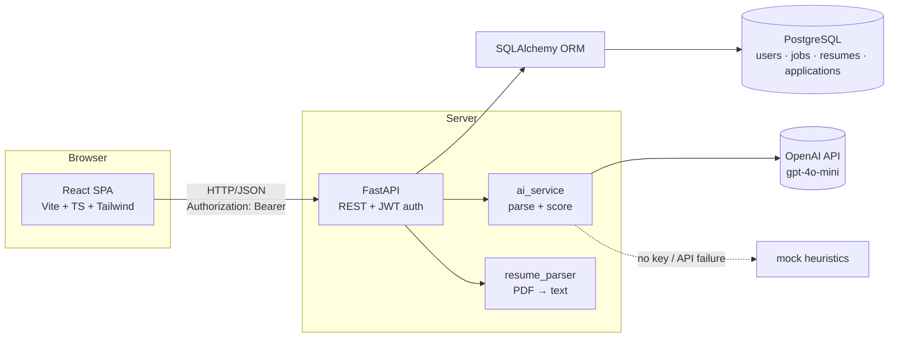
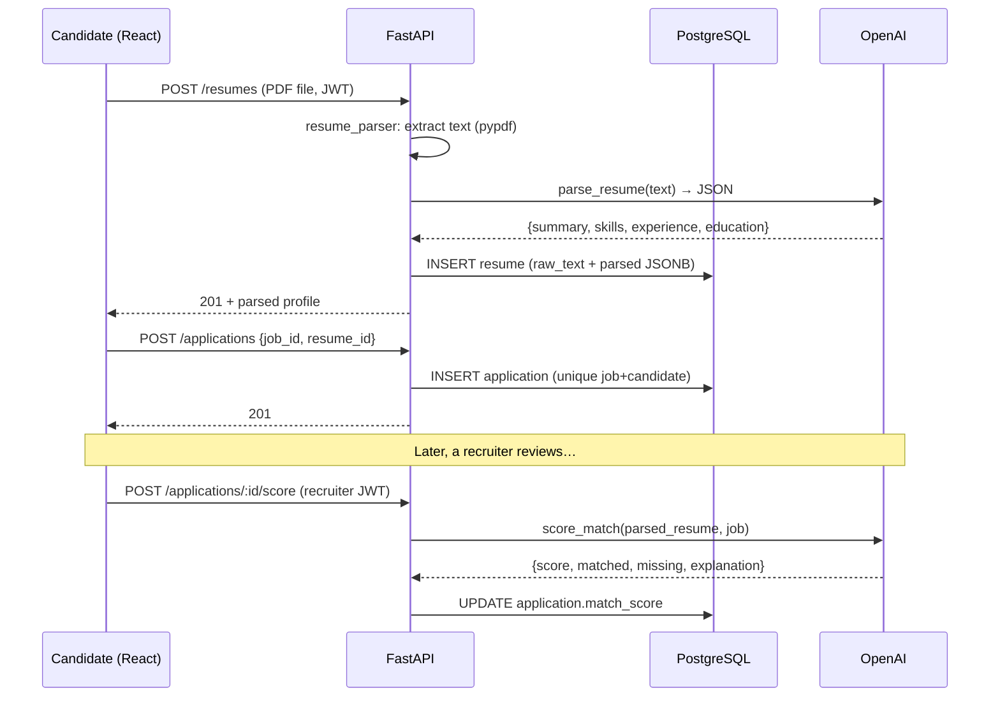

# Architecture

## System overview



## Request lifecycle: applying to a job



## Backend layering

```
routers/      HTTP concerns only: parse request, call service/DB, shape response
deps.py       cross-cutting auth: JWT decode → load user → role check
services/     business logic that isn't HTTP or SQL: AI calls, file parsing
models.py     tables; schemas.py    wire contracts — never the same objects
```

The rule: routers never contain business logic, services never know about HTTP.
This is what makes `ai_service` swappable between OpenAI and the mock — the
router calls `ai_service.parse_resume()` and doesn't care which runs.

## Auth model

- Passwords hashed with **argon2id** (pwdlib) — memory-hard, GPU-resistant.
- Login issues a **JWT** signed with HS256, containing `sub` (user id), `role`,
  `exp`. No server-side session storage needed.
- Every protected request: `HTTPBearer` → decode JWT → load user from DB →
  `require_role` checks `recruiter` vs `candidate`.
- Authorization is enforced **server-side per resource**: recruiters can only
  see/modify their own jobs (`_owned_job`) and applications to them; candidates
  can only use their own resumes.

## Failure design

| Failure | Behavior |
|---|---|
| No `OPENAI_API_KEY` | Mock parser/scorer — app fully usable offline |
| OpenAI call throws | Falls back to mock result (AI degrades, app survives) |
| Duplicate application | DB unique constraint → 409, never a partial write |
| Scanned/image PDF | `UnsupportedFileError` → 422 with clear message |
| Recruiter hits another's job | 403 ownership check on every mutating route |
