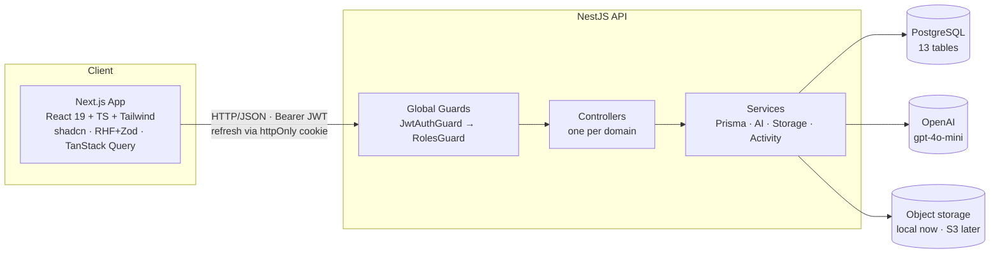
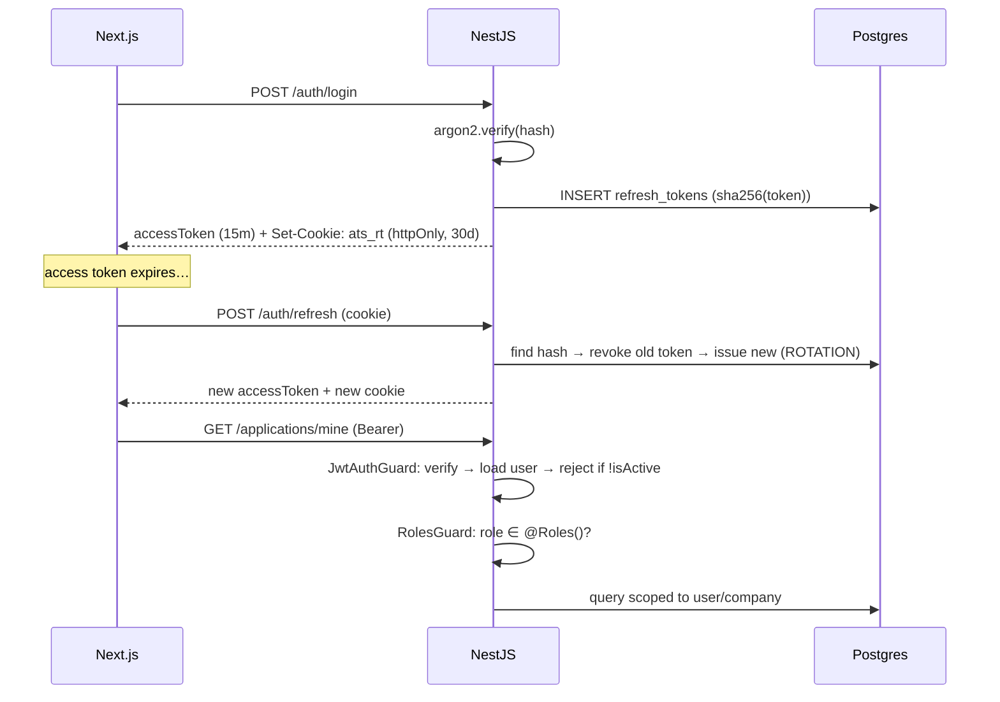

# Architecture

## System overview



## Why NestJS (spec asked for justification)

Express leaves architecture to convention — you'd hand-roll routing
structure, auth middleware, DI, and validation. NestJS gives all of it as
first-class concepts, which is what "production-style" actually means:

- **Modules** = bounded contexts (auth, applications, admin…). The app module
  is a dependency graph you can read top-to-bottom.
- **Guards** = RBAC as infrastructure, not per-route ifs. `JwtAuthGuard` +
  `RolesGuard` run globally; routes opt out with `@Public()` or restrict with
  `@Roles()`. This maps exactly to "Hiring managers should NOT have
  unrestricted admin access" — it's enforced in two lines of metadata.
- **DI** = swappable providers. `STORAGE` token injects `LocalStorageService`
  today, `S3StorageService` tomorrow — zero call-site changes. Same for the AI
  service's OpenAI/mock switch.
- **ValidationPipe + DTOs** = class-validator schemas at the edge, the backend
  equivalent of the spec's Zod requirement on the frontend.

## Auth flow



Rotation means a stolen refresh token dies after one use (the legitimate
client's next refresh would fail → detection signal). Only the **hash** is
stored — like passwords, tokens are never recoverable from the DB.

## Authorization layers

1. **Role** — `@Roles(RECRUITER, ADMIN)` on controllers.
2. **Tenant scope** — every staff query filters `companyId === user.companyId`.
3. **Row scope** — hiring managers additionally need `job.hiringManagerId ===
   user.id` (`staffJob()` in applications controller).
4. **Ownership** — candidates only touch their own resumes/applications.
5. **Superadmin** — `isSuperadmin` flag bypasses role+scope checks (platform
   staff). Separate from role so it's auditable.

## Storage abstraction

```ts
interface ObjectStorage { put(key, data); get(key): Buffer }
```

Callers deal in opaque keys (`resumes/<uuid>.pdf`) — the same addressing model
S3 uses. Local disk implements it now; an S3 provider is a new class + one
provider registration. Downloads stream through the API (auth-checked) — could
later become presigned-URL redirects.

## AI boundary

One `AiService`, five features — `parseResume`, `scoreMatch`,
`summarizeCandidate`, `generateInterviewQuestions`, `analyzeJobDescription`.
Every method: try OpenAI JSON-mode → **fall back to deterministic mock** on
missing key or API failure. The app never hard-depends on an external service.

## Failure design

| Failure | Behavior |
|---|---|
| No `OPENAI_API_KEY` | Mock AI — fully functional demo |
| OpenAI error | Falls back per-call, logs warning |
| Expired access token | Silent refresh + retry (client) |
| Suspended user | Blocked at login AND every guarded request |
| Duplicate apply | `@@unique(jobId,candidateId)` → 409 |
| Notification write fails | Never fails the request (audit-safe logging) |
