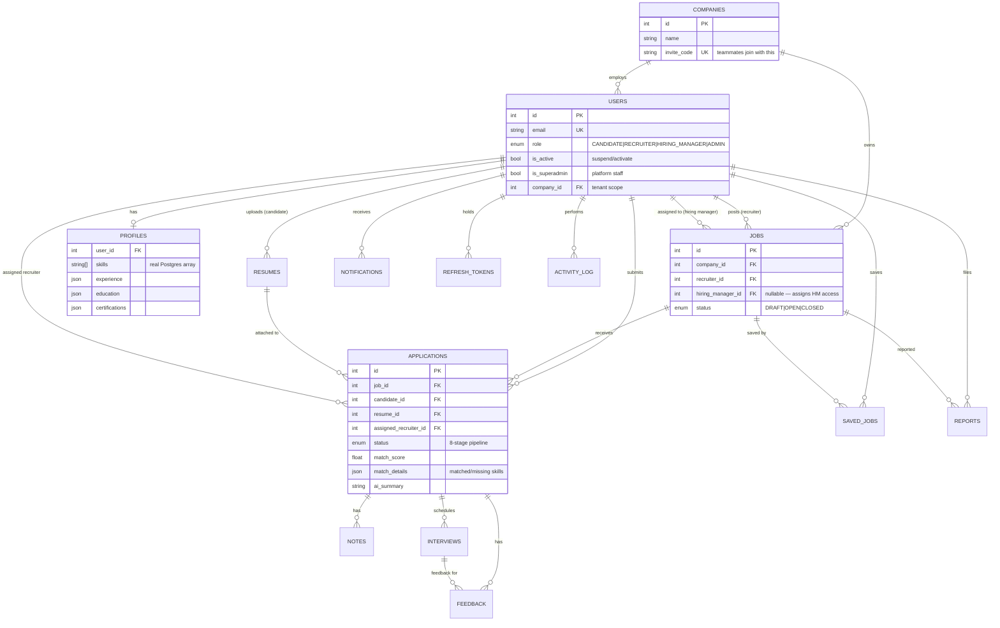

# Database Design

Prisma schema (`backend/prisma/schema.prisma`) is the source of truth;
`prisma migrate dev` diffs it against the DB and generates versioned SQL.

## ERD



Remaining tables: `resumes` (storage_key + raw_text + parsed JSONB),
`notes` (internal), `feedback` (rating + interview link), `interviews`,
`saved_jobs`, `notifications`, `reports` (job moderation), `activity_log`
(audit), `refresh_tokens` (sha256 only).

## Key decisions

**Multi-tenancy is a foreign key, not a database.** Every staff query filters
`job.companyId === user.companyId`. One DB, one schema, cheap isolation —
the standard SaaS pattern until tenants need hard separation.

**`applications` = join table + state machine.** Unique(job_id, candidate_id)
enforces apply-once at the DB level (race-safe). Status is an enum:
`APPLIED → SCREENING → SHORTLISTED → INTERVIEW → OFFER → HIRED`, plus
`REJECTED` and `WITHDRAWN` (candidate self-service, only allowed from the
first two states — a business rule in code, not the schema).

**JSONB where the shape belongs to AI or the user.** `resumes.parsed`,
`match_details`, profile `experience/education/certifications` — semi-structured
data that would need 4 more tables to normalize, and whose shape evolves.
`profile.skills` is a real `text[]` instead — arrays stay queryable
(`'typescript' = ANY(skills)`).

**Files are keys, not blobs.** Resumes store `storage_key` + extracted
`raw_text` (needed for AI anyway). The file lives in object storage —
swappable backend, DB stays lean.

**Refresh tokens are hashed, rotatable rows.** `sha256(token)` + `revoked_at`
enables rotation and revocation — the difference between "JWT" and "JWT done
properly". Reuse of a rotated token is a theft signal.

**`activity_log` = auditability.** Every meaningful action writes a row
(actor, action, entity). Powers the admin "monitor platform activity" view
and answers "who did this" forever.

## Migrations

```bash
npx prisma migrate dev --name <change>   # dev: diff + apply + regenerate client
npx prisma migrate deploy                # prod: apply committed migrations only
npx prisma db seed                       # demo data (prisma/seed.ts)
```
