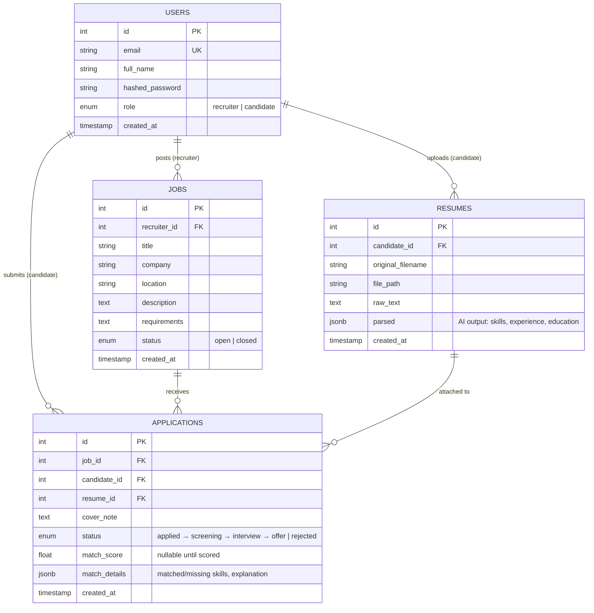

# Database Design

## ERD



## Design decisions

**`applications` is a join table with payload.** It's the many-to-many between
candidates and jobs, but it also owns data: status, cover note, which resume
was used, and the AI match result. `UNIQUE(job_id, candidate_id)` enforces
"apply once" at the DB level — not just in app code, so race conditions and
double-submits can't create duplicates.

**`resumes.parsed` is JSONB, not columns.** The AI returns semi-structured data
(skills array, experience objects) whose shape may evolve. JSONB avoids
over-normalizing while staying queryable (`parsed->'skills'` works in SQL if
we ever need it). `match_details` uses JSONB for the same reason.

**Indexes on every foreign key** (`recruiter_id`, `candidate_id`, `job_id`) —
these are the columns we filter/join on constantly. `users.email` is unique +
indexed for login lookups.

**Enums at the DB level** (`role`, `status`) — Postgres rejects invalid values
before the app even sees them. Pipeline status is an enum, which keeps the
state machine (`applied → screening → interview → offer | rejected`) explicit.

**Why not store resumes in Postgres?** Files live on disk (`uploads/` with
UUID names — never user filenames), the DB stores metadata + extracted text +
parsed JSON. Blob-in-DB works but bloats backups; at scale you'd swap
`file_path` for an S3 key.

## Migrations

Schema changes are versioned with Alembic:

```bash
uv run --no-project alembic revision --autogenerate -m "describe change"
uv run --no-project alembic upgrade head
```

Autogenerate diffs `models.py` against the live DB and writes the migration.
Never hand-edit the DB — every schema change goes through a migration so it
can be replayed on any environment (and rolled back with `downgrade -1`).
