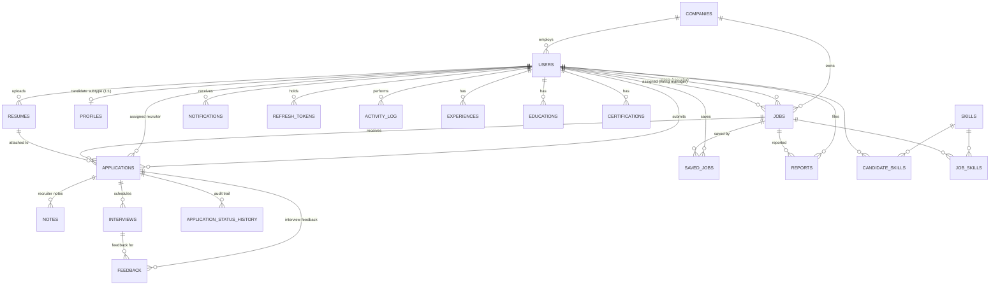

# Database Design

PostgreSQL 16, Prisma schema (`backend/prisma/schema.prisma`) as source of
truth — `prisma migrate` generates versioned SQL diffs. **20 tables**, fully
normalized skills taxonomy.

## ER diagram



## Tables

| Table | PK | FKs | Purpose |
|---|---|---|---|
| `companies` | id | — | Tenant root; `invite_code` joins teammates |
| `users` | id | `company_id`→companies | All roles in one table |
| `profiles` | id | `user_id`→users | **Candidate subtype** — candidate-only attrs |
| `skills` | id | — | Canonical skill vocabulary |
| `candidate_skills` | (user_id, skill_id) | →users, →skills | M:N user↔skill + provenance |
| `job_skills` | (job_id, skill_id) | →jobs, →skills | M:N job↔skill |
| `experiences` | id | `user_id`→users | Candidate work history |
| `educations` | id | `user_id`→users | Candidate education |
| `certifications` | id | `user_id`→users | Candidate certs |
| `resumes` | id | `candidate_id`→users | storage_key + raw_text + parsed JSONB |
| `jobs` | id | `company_id`, `recruiter_id`, `hiring_manager_id` | Posting + lifecycle |
| `applications` | id | `job_id`, `candidate_id`, `resume_id`, `assigned_recruiter_id` | Join table + state machine |
| `application_status_history` | id | `application_id`, `changed_by_id` | Immutable transition log |
| `notes` | id | `application_id`, `author_id` | Internal recruiter notes |
| `feedback` | id | `application_id`, `interview_id?`, `author_id` | Interview feedback + rating |
| `interviews` | id | `application_id`, `scheduled_by_id` | Schedule slots |
| `saved_jobs` | (user_id, job_id) | →users, →jobs | Bookmarks M:N |
| `notifications` | id | `user_id`→users | In-app alerts |
| `reports` | id | `job_id`, `reporter_id` | Job moderation queue |
| `refresh_tokens` | id | `user_id`→users | Hashed, rotatable sessions |
| `activity_log` | id | `actor_id`→users | Platform audit trail |

## Inheritance: User → roles

The spec's `User { Candidate, Recruiter, HiringManager, Admin }` diagram is
implemented as **single-table inheritance + one subtype table**:

- `users` holds every shared attribute; `role` discriminates behavior.
- `profiles` IS the Candidate subtype (1:1, only exists for candidates).
- Recruiter/HM/Admin have **zero** role-specific columns — subtype tables
  would be 2 extra joins for no data. Classic normalization-vs-joins call;
  documented deliberately.

## Relationship cardinalities

**One-to-one:** `users 1—0..1 profiles` (`user_id UNIQUE`)

**One-to-many:** companies→users, companies→jobs, users→resumes,
users→applications (as candidate, recruiter poster, hiring manager, assigned
recruiter — **4 FKs from users to jobs/applications**), jobs→applications,
applications→{notes, feedback, interviews, history}, users→{experiences,
educations, certifications, notifications, saved_jobs, reports}

**Many-to-many** (all as join tables — never implicit):
- `candidate_skills` (users × skills, +`source` payload column)
- `job_skills` (jobs × skills)
- `saved_jobs` (users × jobs)
- `applications` is the heavyweight join: users × jobs × resumes **plus**
  payload (status, scores, AI fields)

## Unique constraints

| Constraint | Why |
|---|---|
| `users.email` | Identity |
| `companies.invite_code` | Join-by-code lookup |
| `profiles.user_id` | Enforces the 1:1 subtype |
| `skills.name` | Canonical vocabulary — dedupes 'TypeScript' vs 'typescript' |
| `applications.(job_id, candidate_id)` | Apply-once, race-safe at DB level |
| `saved_jobs.(user_id, job_id)` | No duplicate bookmarks |
| `candidate_skills.(user_id, skill_id)` | Composite PK |
| `job_skills.(job_id, skill_id)` | Composite PK |

## Indexes

Beyond PK/UNIQUE indexes, explicit `@@index` on every hot lookup:
`users.company_id`, `jobs.company_id`, `applications.job_id` /
`.candidate_id` / `.resume_id` / `.assigned_recruiter_id`,
`experiences/educations/certifications.user_id`,
`application_status_history.application_id`, `resumes.candidate_id`,
`notifications.user_id`, `reports.job_id`, `activity_log.actor_id`,
`refresh_tokens.user_id` / `.token_hash`.

## Cascading rules

| FK | Rule | Rationale |
|---|---|---|
| profiles→users | CASCADE | Candidate data dies with the user |
| candidate_skills→{users,skills} | CASCADE | Links are pure join rows |
| job_skills→{jobs,skills} | CASCADE | Same |
| exp/edu/certs→users | CASCADE | Owned history |
| resumes→users | CASCADE | GDPR: deleting user purges files' records |
| applications→{jobs,candidates,resumes} | CASCADE | Applications are join records |
| notes/feedback/interviews/history→applications | CASCADE | Owned children |
| feedback→interviews | SetNull | Feedback survives a cancelled interview |
| saved_jobs/notifications/reports→parents | CASCADE | Ephemeral links |
| jobs→companies | Restrict (default) | Never orphan a company's postings |
| refresh_tokens/activity_log→users | CASCADE / SetNull | Tokens die with user; audit survives |

## Key decisions

**Normalized skills taxonomy** (`skills` + two join tables) replaces `text[]`.
Cost: 2 joins. Buy: platform-wide vocabulary, `source` provenance
('manual'|'resume'), skill-based candidate search, and job↔candidate matching
as set intersection instead of string matching.

**`application_status_history` is append-only.** The current status lives on
`applications` (indexed, one read); the table is the immutable "who moved
whom when" — powers the pipeline timeline UI and compliance questions.

**JSONB survives in exactly two places** where the shape belongs to AI output,
not the domain: `resumes.parsed` and `applications.match_details`. Everything
user-owned is normalized rows.

**Files are keys, not blobs.** `resumes.storage_key` addresses the object
store; `raw_text` is kept because AI features need the text anyway.

## Migrations

```bash
npx prisma migrate dev --name <change>   # dev: diff + apply + regenerate client
npx prisma migrate deploy                # prod: apply committed migrations only
npx prisma db seed                       # demo data (prisma/seed.ts)
```
