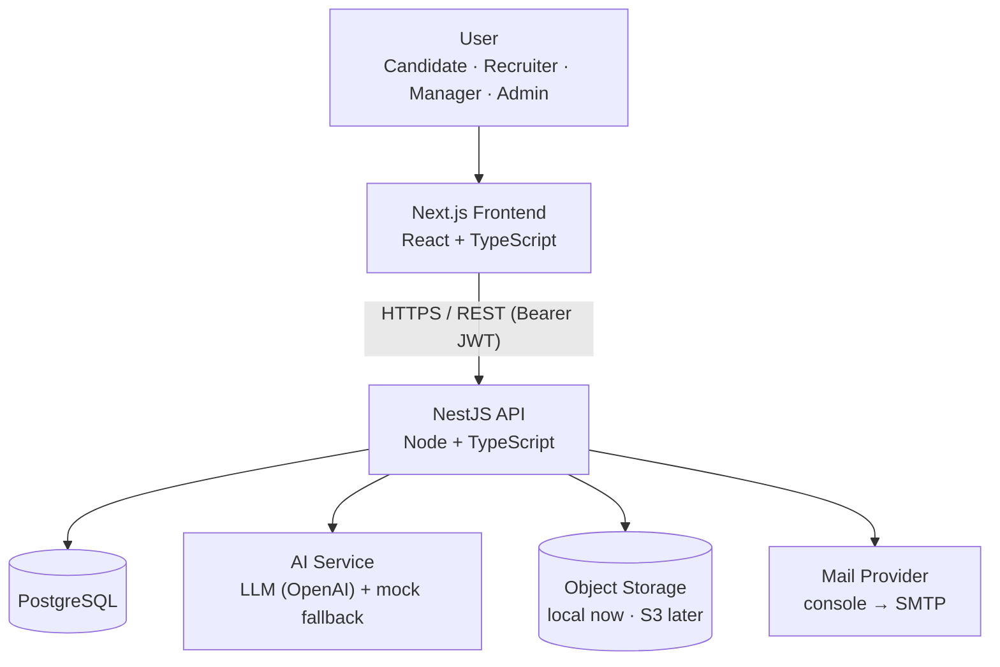
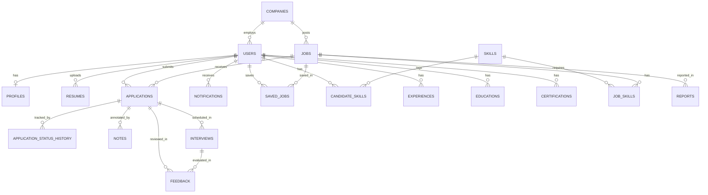
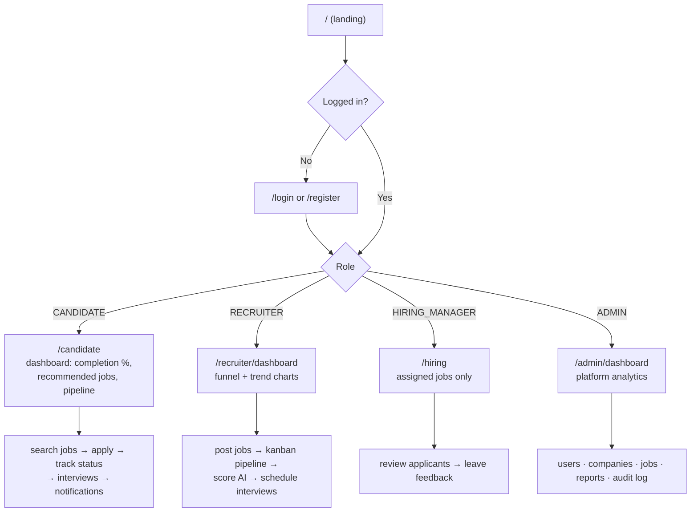
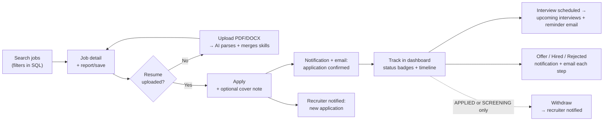
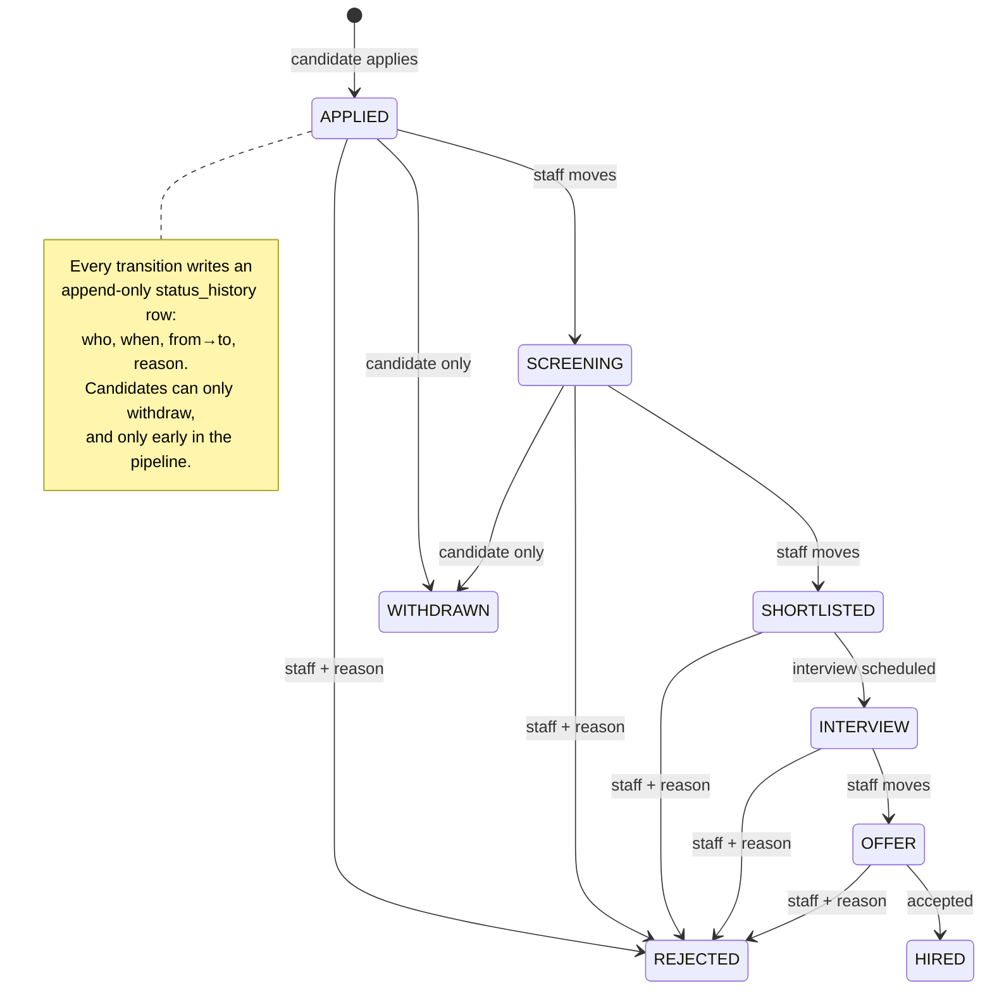
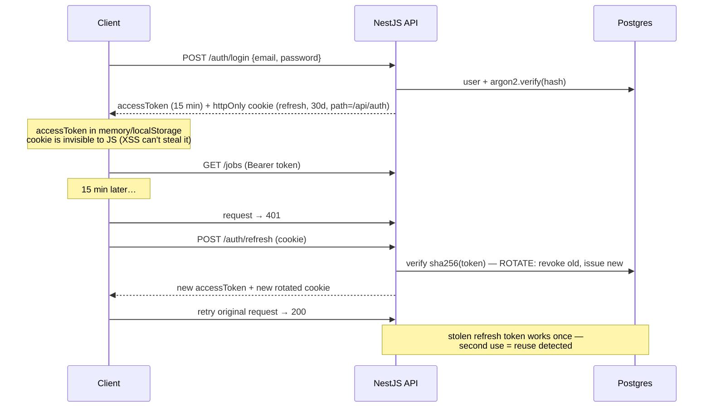
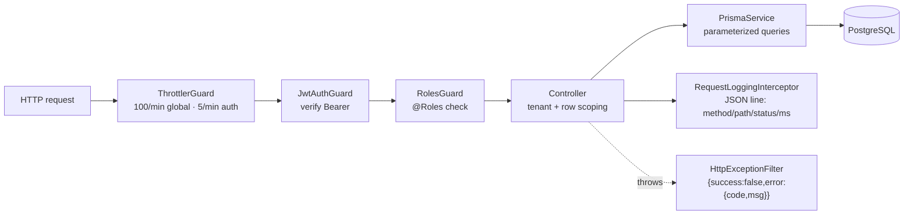
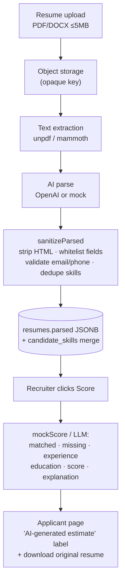
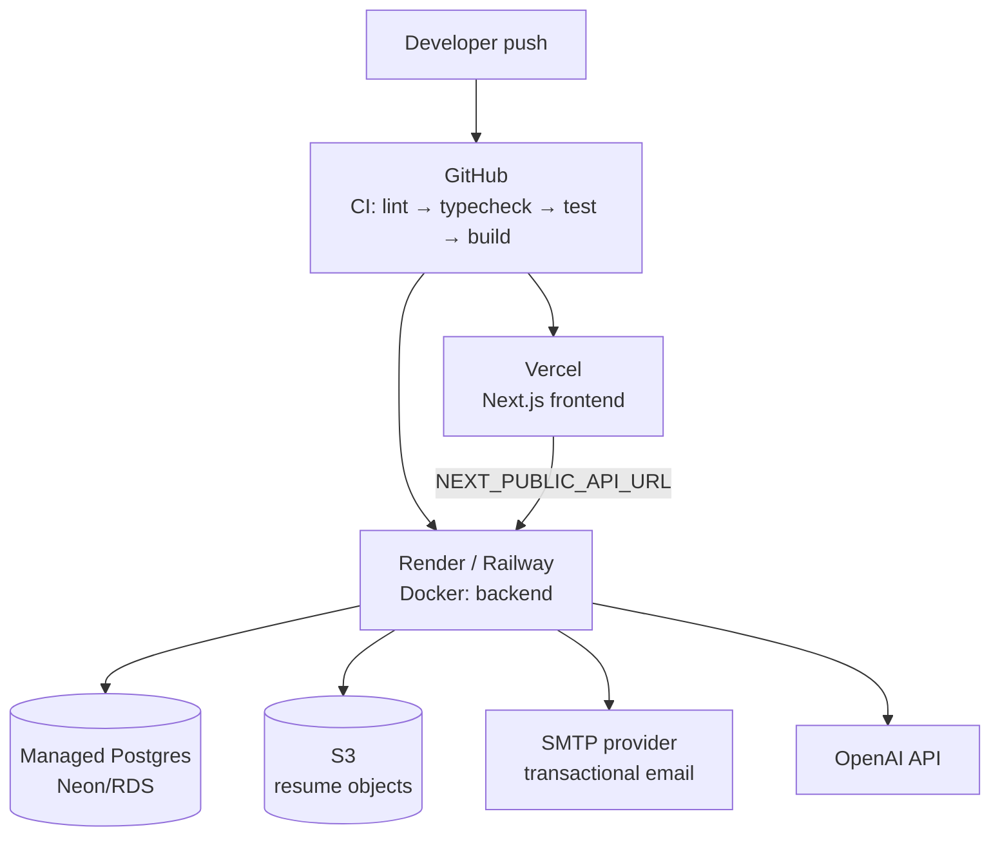
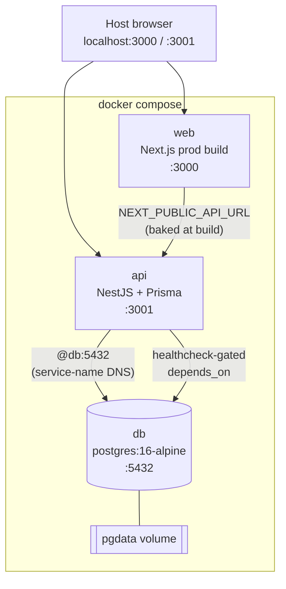

# Diagrams

Ten Mermaid diagrams covering the system end to end. Every diagram has a
plain-English explanation underneath. Mermaid renders natively on GitHub.

## 1. System Architecture

**In plain English:** Users talk only to the frontend. The frontend calls the
API over HTTPS with a JWT. The API owns every downstream dependency — the
database holds relational data, files live in object storage (Postgres only
stores the key), the AI service wraps the LLM behind a mock fallback, and
email goes through a swappable provider. No client ever touches the database
or storage directly.

## 2. ER Diagram (core entities)

**In plain English:** A company posts jobs; a user applies to them, producing
an *application* — the pipeline's center of gravity. Everything hangs off
either the user (profile, resumes, skills, notifications) or the application
(status history, notes, feedback, interviews). Skills are a canonical table
joined to both candidates and jobs, which is what makes skill-based matching
and job recommendations a simple join. See `DATABASE.md` for the full ERD.

## 3. User Flow (by role)

**In plain English:** One landing page, one login — then the router sends
each role to its own portal. Candidates get a personal dashboard, recruiters
get the hiring cockpit, hiring managers see only their assigned jobs, and
admins get the platform view.

## 4. Candidate Application Flow

**In plain English:** Search → detail → apply with a resume (upload first if
needed — AI parses it). Every step notifies: the candidate gets a receipt,
the recruiter gets the application. Status changes, interviews, offers and
rejections all flow through notifications + email, and the dashboard shows
the whole journey.

## 5. Recruitment Pipeline

**In plain English:** A kanban board — staff drag cards forward, candidates
can only withdraw (and only before interview). Every move lands in
`application_status_history` as an immutable audit row, so the timeline on
the applicant page replays the whole journey.

## 6. Authentication Flow

**In plain English:** Short-lived access tokens do the work; the refresh
token lives in an httpOnly cookie that JavaScript can't read, scoped to
`/api/auth` so CSRF can't carry it elsewhere. Refresh tokens rotate — only
the hash is stored — so a leaked token is single-use. The frontend retries
401s once through refresh transparently.

## 7. API Architecture

**In plain English:** Every request passes three guards in order — rate
limit, authenticate, authorize — then the controller applies tenant and row
scoping before touching Prisma. The interceptor logs a structured line for
every call; thrown exceptions become the uniform error envelope. Guards,
interceptor, and filter are all global — no endpoint can forget them.

## 8. AI Resume Analysis Flow

**In plain English:** The spec's example flow with two safety gates it didn't
draw: uploads are validated and stored by key (never in the DB), and AI
output is *sanitized* before it's trusted — scripts stripped, fields
whitelisted. Scores are always labeled as estimates next to the original
resume download.

## 9. Deployment Architecture

**In plain English:** Push → CI gates the build → frontend ships to Vercel,
backend to a Docker host. Each external service swaps in via env vars:
managed Postgres for the DB URL, S3 for the `STORAGE` provider, SMTP for the
`MailProvider`, OpenAI for `AiService`. Every provider is behind an
interface — the swap is configuration, not code.

## 10. Docker Architecture

**In plain English:** Three services on a private Compose network — `api`
reaches Postgres at the hostname `db` (Compose's built-in DNS), the browser
reaches web/api through published ports. The API waits for Postgres's
`pg_isready` healthcheck before starting; data survives `down` in the
`pgdata` volume. `NEXT_PUBLIC_API_URL` is a build arg because Next.js
inlines public env at build time.
